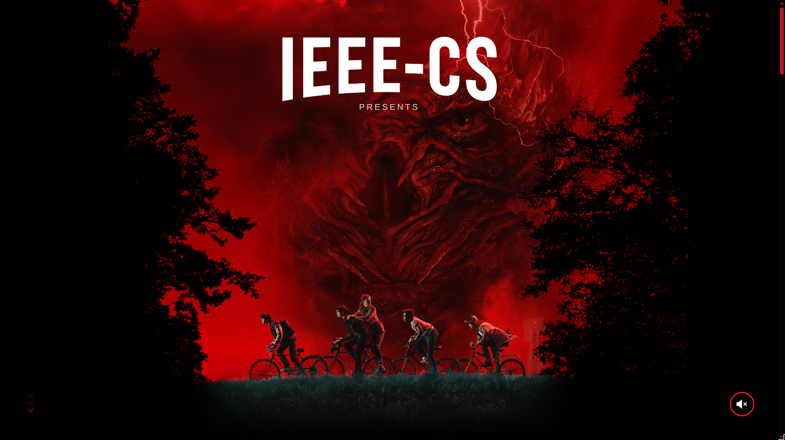
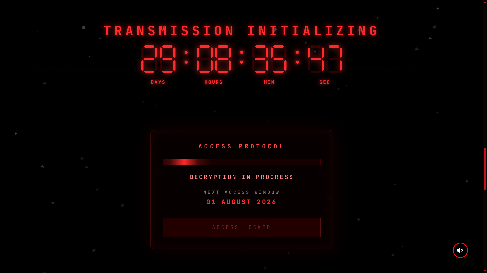
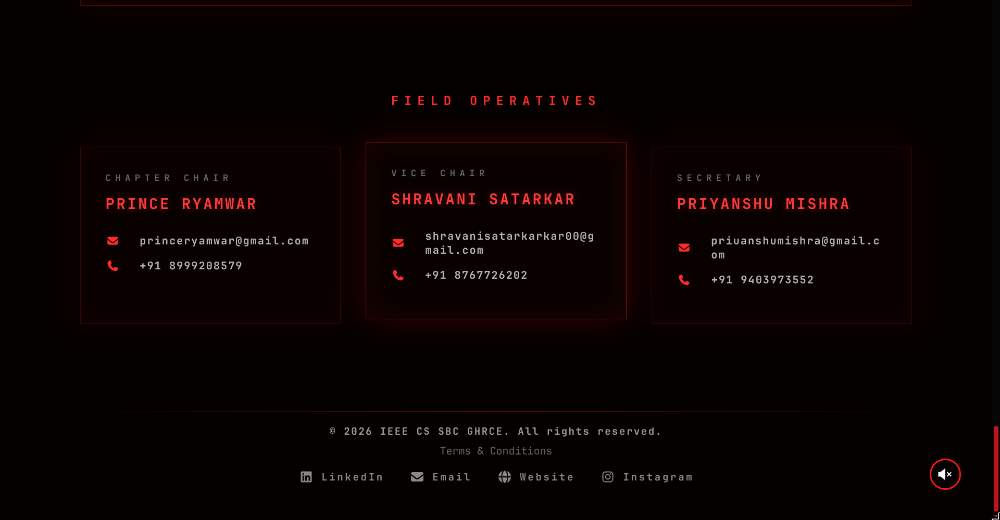

# CYGNUS 2026

A Stranger Things-inspired event website built for the IEEE Computer Society Student Branch Chapter, GHRCE.

## Features

- Cinematic loader
- Parallax hero section
- Scroll-driven logo reveal
- Live countdown
- Transmission terminal panel
- Stranger Things themed UI
- Responsive design
- Animated particle system
- Event gallery (upcoming)
- Contact section

## Tech Stack

- React
- Vite
- CSS3
- JavaScript

## Screenshots

# CYGNUS 2026

## Hero

## Countdown

## Footer

## Getting Started

git clone https://github.com/XNOXtm/IEEECS-cygnus-2026.git
npm install
npm run dev

## Build

npm run build

## Authors

Tushar Mishra
IEEE Computer Society GHRCE

## License

This project is created for IEEE CS GHRCE.
